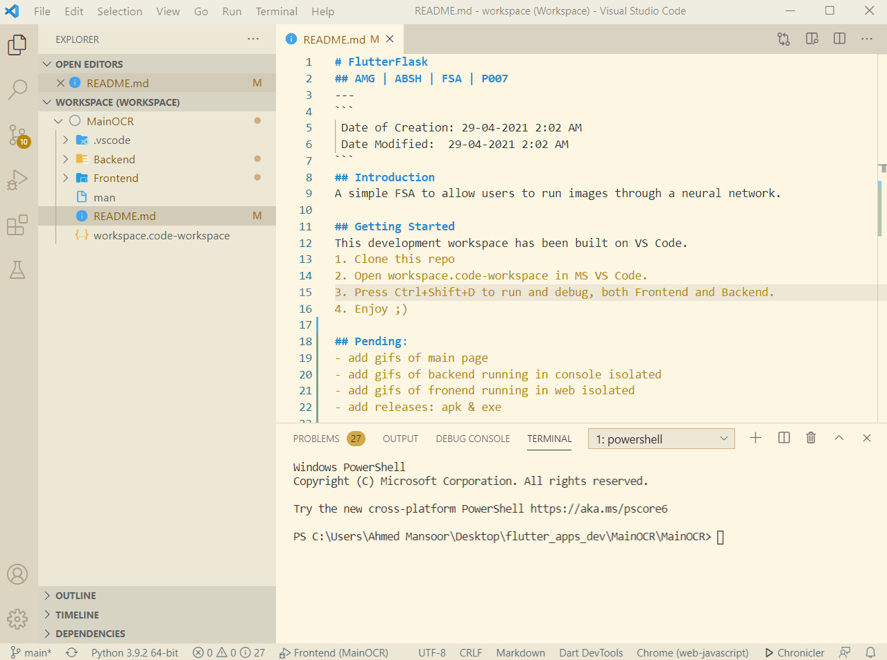

# FlutterFlask
## AMG | ABSH | FSA | P007
---
```
 Date of Creation: 29-04-2021 2:02 AM
 Date Modified:  29-04-2021 11:49 PM
```
## Introduction
This is the source code for a development workspace of a VSCode project.
A simple full-stack application is developed to allow users to run images through a neural network.
The frontend in made on Flutter in Dart and the backend is Flask on Python. 
<br>

<br>

## Getting Started
This development workspace has been built on VS Code.
1. Clone this repo
2. Open workspace.code-workspace in MS VS Code.
3. Press Ctrl+Shift+D to run and debug, both Frontend and Backend.
4. The Backend will run on VS Code built-in Terminal
5. The Frontend will run on Chrome
6. They work with each other on localhost. Enjoy ;)

## Pending:
- <del> add gifs of main page </del>
- <del> add gifs of backend running in console isolated </del>
- <del> add gifs of fronend running in web isolated </del>
- add releases: apk & exe
- add backend func: train network??
   

**UPDATE**
30-05-2021: Renaming FlutterFlask dirs to Python/Dart for Flutter compat.
---
// ~ A7